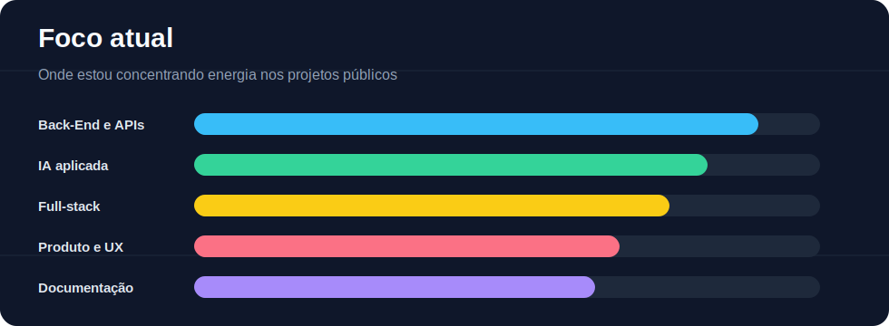
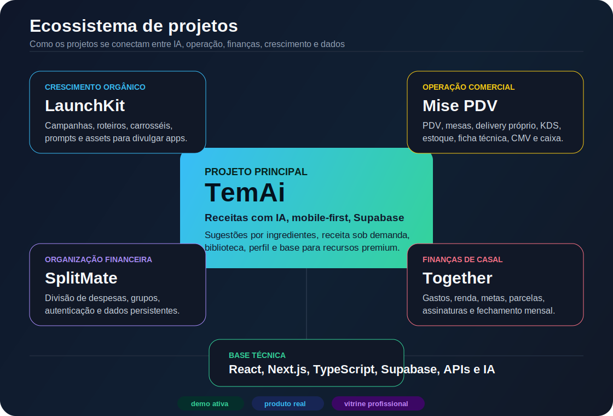

<div align="center">

# Bruno Mafra


Desenvolvedor Back-End / Full-Stack em formação, cursando o 3º período de ADS, com foco em Python, TypeScript, Supabase, IA aplicada e produtos reais.

Antes da tecnologia, atuei como chef executivo, liderando equipes com mais de 35 pessoas. Hoje trago essa experiência de operação, pressão, comunicação e liderança para construir software com clareza de produto.

<a href="https://www.linkedin.com/in/bruno-carnauba-mafra-4358a1158/">
  
</a>
<a href="https://github.com/brunomafra-dev">
  
</a>

</div>

---

## O que busco agora

```txt
perfil profissional
├─ posição: Desenvolvedor Back-End / Full-Stack Júnior
├─ formação: 3º período de ADS + cursos completos na DIO
├─ foco: Python, TypeScript, React/Next.js, Supabase e IA aplicada
├─ diferencial: liderança real, operação sob pressão e visão de produto
└─ objetivo: primeira oportunidade tech, estágio ou vaga júnior
```

## Liderança e trajetória

Minha transição para tecnologia não começou do zero em termos profissionais. Como chef executivo, aprendi a lidar com operação real: prazos curtos, equipe grande, pressão diária, comunicação clara e tomada de decisão com impacto direto no resultado.

Essa experiência aparece no jeito como construo projetos:

- Penso em fluxo de uso, não só em tela bonita.
- Organizo prioridades e entregas como produto em evolução.
- Documentação, demo e narrativa importam porque uma ideia precisa ser entendida rápido.
- Tenho maturidade para receber feedback, ajustar rota e trabalhar em equipe.
- Busco escrever código com responsabilidade, porque software também é operação.

## Stack principal


## Gráfico de foco



## Projeto principal

### TemAi

O TemAi é meu projeto principal de IA aplicada: um app mobile-first de receitas que transforma ingredientes disponíveis em sugestões rápidas e receitas completas sob demanda.

[Repositório](https://github.com/brunomafra-dev/TemAi) | [Demo ativa](https://temaiapp.vercel.app)

**Pontos fortes do projeto:**

- Fluxo de IA em duas etapas: sugestões primeiro, receita completa só quando o usuário escolhe.
- Experiência mobile-first, com foco em uso rápido e direto.
- Biblioteca de receitas, páginas públicas, perfil de usuário e base preparada para recursos premium.
- Integração com Supabase e rotas de API separadas para organizar responsabilidades.

## Mapa do ecossistema



## Projetos em destaque

| Projeto | Papel na minha vitrine | Status |
| --- | --- | --- |
| [TemAi](https://github.com/brunomafra-dev/TemAi) | Produto principal: IA aplicada, experiência mobile-first, Supabase, biblioteca e fluxo de receita. | [Demo ativa](https://temaiapp.vercel.app) |
| [Mise PDV Inteligente](https://github.com/brunomafra-dev/sabore-pdv-inteligente) | SaaS para restaurantes: PDV, mesas, delivery próprio, KDS, estoque, ficha técnica, CMV, caixa e gestão por plano. | [Demo ativa](https://misepdvinteligente.vercel.app/) |
| [Together](https://github.com/brunomafra-dev/Together) | Finanças de casal: gastos, rendas, contas fixas, parcelas, assinaturas, metas, fechamento mensal e projeção futura. | [Demo ativa](https://togetherbr.vercel.app/) |
| [LaunchKit](https://github.com/brunomafra-dev/LaunchKit) | Crescimento orgânico: campanhas, roteiros, carrosséis, prompts e assets para divulgar meus próprios apps. | [Demo ativa](https://launch-kit-omega.vercel.app) |
| [SplitMateApp](https://github.com/brunomafra-dev/SplitMateApp) | Organização financeira: divisão de despesas em grupo, autenticação e dados persistentes. | [Demo ativa](https://splitmateapp.vercel.app/) |

## Stack por camada

| Camada | Tecnologias e práticas | Onde aparece |
| --- | --- | --- |
| Interface | Next.js, React, Vite, Tailwind CSS, design mobile-first | TemAi, Mise, Together, LaunchKit e SplitMate |
| Backend | API Routes, organização de regras, validação de fluxo e integração com serviços | TemAi, Mise e SplitMate |
| Dados | Supabase, autenticação, RLS, persistência, storage e perfis | TemAi, Together, Mise e SplitMate |
| IA aplicada | Geração de receitas, prompts, roteiros, campanhas e automação de conteúdo | TemAi e LaunchKit |
| Produto | README, demo, status de deploy, documentação e narrativa de uso | Perfil, repositórios e portfólio |

<details>
<summary><strong>Como penso produto e código</strong></summary>

- Começo pelo problema real que a aplicação resolve.
- Priorizo fluxos navegáveis, README claro e demo funcional.
- Gosto de separar bem backend, UI, dados e regras de domínio.
- Trato projeto público como vitrine: nome, descrição, documentação e deploy também contam.
- Busco construir projetos que pareçam usáveis de verdade, não só provas de conceito.

</details>

## Próximos passos

- Melhorar os READMEs individuais dos projetos com prints, decisões técnicas e instruções de uso.
- Evoluir o TemAi como case principal de IA aplicada.
- Consolidar o Together como app financeiro real de casal.
- Evoluir o Mise como case SaaS operacional para restaurantes.
- Continuar usando o LaunchKit para apoiar crescimento orgânico dos projetos.

## Contato

<div align="center">

Vamos conversar sobre backend, IA aplicada, produto ou primeira oportunidade tech.

<br />
<br />

<a href="https://www.linkedin.com/in/bruno-carnauba-mafra-4358a1158/">
  
</a>
<a href="https://github.com/brunomafra-dev">
  
</a>

</div>
